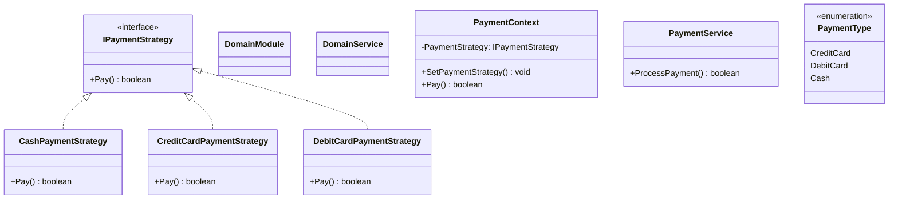

```mermaid
classDiagram


class CashPaymentStrategy{
            
            +Pay() boolean
        }
IPaymentStrategy<|..CashPaymentStrategy
class CreditCardPaymentStrategy{
            
            +Pay() boolean
        }
IPaymentStrategy<|..CreditCardPaymentStrategy
class DebitCardPaymentStrategy{
            
            +Pay() boolean
        }
IPaymentStrategy<|..DebitCardPaymentStrategy
class DomainModule{
            
            
        }
class DomainService{
            
            
        }
class IPaymentStrategy {
            <<interface>>
            
            +Pay() boolean
        }
class PaymentContext{
            -PaymentStrategy: IPaymentStrategy
            +SetPaymentStrategy() void
+Pay() boolean
        }
class PaymentService{
            
            +ProcessPayment() boolean
        }
class PaymentType {
        <<enumeration>>
        CreditCard
DebitCard
Cash
      }
```